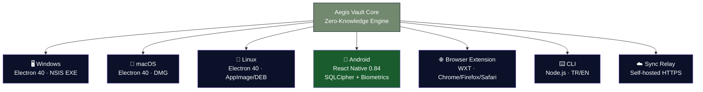
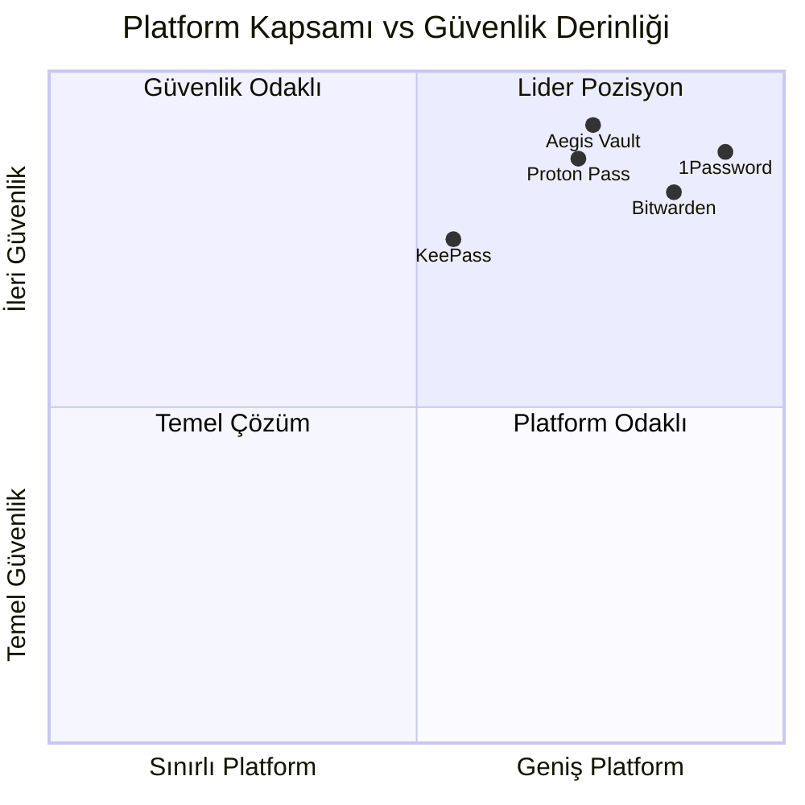

# 🛡️ Aegis Vault 5.0 — Profesyonel Analiz Raporu

**Tarih:** 7 Mayıs 2026  
**Kapsam:** Güvenlik · Özellikler · Tasarım · Rakip Karşılaştırma · Puanlama · Öneriler

---

## 📋 Yönetici Özeti

Aegis Vault 5.0, **offline-first, zero-knowledge** mimarisine sahip açık kaynak bir şifre yöneticisidir. React 19 + Electron 40 + Vite 7 üzerine inşa edilmiş olup **4 ayrı platformda** çalışır:

| Platform     | Teknoloji                      | Dağıtım                             |
| ------------ | ------------------------------ | ----------------------------------- |
| **Windows**  | Electron 40 (NSIS installer)   | `.exe` masaüstü uygulaması          |
| **macOS**    | Electron 40 (Hardened Runtime) | `.dmg` / `.zip`                     |
| **Linux**    | Electron 40                    | `.AppImage` / `.deb`                |
| **Android**  | React Native 0.84 + SQLCipher  | APK / Play Store                    |
| **Tarayıcı** | WXT Framework                  | Chrome / Firefox / Safari eklentisi |
| **CLI**      | Node.js                        | Bilingual TR/EN terminal arayüzü    |

Proje; 891+ birim testi, 189 E2E testi, %87.36 kapsama oranı ve Stryker mutasyon testleriyle desteklenmektedir.

> [!IMPORTANT]
> Aegis Vault, endüstri standartlarının çoğunu karşılayan güçlü bir güvenlik mimarisine sahiptir ancak **bağımsız üçüncü taraf güvenlik denetimi** henüz yapılmamıştır. Bu, ticari dağıtım öncesi kapatılması gereken en kritik açıktır.

---

## 1. 🔐 Güvenlik Analizi

### 1.1 Kriptografik Yığın

| Katman           | Masaüstü/Web                        | Android                   | Değerlendirme             |
| ---------------- | ----------------------------------- | ------------------------- | ------------------------- |
| Anahtar Türetme  | Argon2id (Web Worker + WASM)        | react-native-argon2       | ✅ Endüstri lideri        |
| Şifreleme        | AES-256-GCM (alan bazlı IV)         | react-native-quick-crypto | ✅ Altın standart         |
| Depolama         | SQLCipher/WASM + OPFS/IDB           | op-sqlite (SQLCipher)     | ✅ Çok katmanlı           |
| Biyometrik       | WebAuthn                            | react-native-biometrics   | ✅ Modern standart        |
| Yedek Bütünlük   | HMAC-SHA256 zarf doğrulama          | Aynı protokol             | ✅ Kurcalama koruması     |
| Senkronizasyon   | ECDH + AES-GCM uçtan uca            | Relay uyumlu              | ✅ Relay düz metin görmez |
| Paylaşım         | ECDH alıcı eşleme + replay koruması | —                         | ✅ İleri seviye           |
| Release İmzalama | Ed25519 manifest + trust chain      | Fastlane CI/CD            | ✅ Tedarik zinciri        |

**Puan: 9.2 / 10**

### 1.2 Güçlü Yönler

- **Argon2id KDF:** Rakiplerin çoğu (1Password, Bitwarden) hâlâ PBKDF2 kullanırken Aegis modern Argon2id'yi tercih etmiştir — hem masaüstünde hem Android'de
- **Alan bazlı IV yönetimi:** Her şifrelenmiş alan ayrı IV kullanır — tek noktadan ihlal riskini ortadan kaldırır
- **Watch-only kripto cüzdan:** İmzalama/yayın kodu bulunmaz — hot wallet olma riski sıfır
- **Kapsamlı tehdit modeli:** THREAT_MODEL.md, güven sınırları, saldırgan modeli ve azaltma stratejilerini detaylı belgeler
- **Mutation testleri:** Kripto cüzdan alanı %97.16 mutasyon direnci — testlerin kalitesini ölçen nadir bir yaklaşım
- **Android SQLCipher:** `op-sqlite` kütüphanesi SQLCipher entegrasyonu ile şifreli veritabanı Android'de de korunur

### 1.3 İyileştirilmesi Gereken Alanlar

| Risk                  | Seviye    | Detay                                                                   |
| --------------------- | --------- | ----------------------------------------------------------------------- |
| Bağımsız denetim yok  | 🔴 Yüksek | Kod denetim-hazır ancak henüz imzalı harici rapor yok                   |
| Memory-safe dil değil | 🟡 Orta   | JavaScript/TypeScript bellek güvenliği garanti etmez                    |
| Clipboard temizleme   | 🟡 Orta   | Zamanlayıcı var ancak kötü amaçlı clipboard yazılımına karşı sınırlı    |
| Android kod imzalama  | 🟡 Orta   | Fastlane pipeline mevcut — Play Store imzalama sertifikası doğrulanmalı |

---

## 2. ⚡ Özellik Analizi

### 2.1 Temel Özellik Matrisi

| Özellik                   | Aegis | Bitwarden | 1Password | Proton Pass |  KeePass   |
| ------------------------- | :---: | :-------: | :-------: | :---------: | :--------: |
| Zero-Knowledge            |  ✅   |    ✅     |    ✅     |     ✅      |     ✅     |
| Açık Kaynak               |  ✅   |    ✅     |    ❌     |     ✅      |     ✅     |
| Offline-First             |  ✅   |    ❌     |    ❌     |     ❌      |     ✅     |
| Argon2id KDF              |  ✅   |    ❌     |    ❌     |     ✅      |     ❌     |
| Windows Masaüstü          |  ✅   |    ✅     |    ✅     |     ❌      |     ✅     |
| macOS Masaüstü            |  ✅   |    ✅     |    ✅     |     ❌      |     ❌     |
| Linux Masaüstü            |  ✅   |    ✅     |    ✅     |     ❌      |     ✅     |
| Android                   |  ✅   |    ✅     |    ✅     |     ✅      | KeePassDX  |
| iOS                       |  ❌   |    ✅     |    ✅     |     ✅      | KeePassium |
| Tarayıcı Eklentisi        |  ✅   |    ✅     |    ✅     |     ✅      |   Plugin   |
| CLI Arayüzü               |  ✅   |    ✅     |    ✅     |     ❌      |     ❌     |
| E2E Sync                  |  ✅   |    ✅     |    ✅     |     ✅      |     ❌     |
| Self-Hosted Relay         |  ✅   |    ✅     |    ❌     |     ❌      |    N/A     |
| Alias/Maskelenmiş E-posta |  ✅   |    ❌     |    ✅     |     ✅      |     ❌     |
| Passkey Yönetimi          |  ✅   |    ✅     |    ✅     |     ✅      |   Plugin   |
| TOTP Entegrasyonu         |  ✅   |  ✅(Pro)  |    ✅     |     ✅      |   Plugin   |
| Kripto Cüzdan             |  ✅   |    ❌     |    ❌     |     ❌      |     ❌     |
| Acil Erişim               |  ✅   |  ✅(Pro)  |    ❌     |     ❌      |     ❌     |
| Güvenlik Merkezi          |  ✅   |    ✅     |    ✅     |     ✅      |     ❌     |
| Otomatik Triage           |  ✅   |    ❌     |    ❌     |     ❌      |     ❌     |
| Paylaşım (E2E)            |  ✅   |    ✅     |    ✅     |     ❌      |     ❌     |
| QR Senkronizasyon         |  ✅   |    ❌     |    ❌     |     ❌      |     ❌     |
| Çift Dil (TR/EN)          |  ✅   |    ❌     |    ❌     |     ❌      |     ❌     |
| Release Trust Chain       |  ✅   |    ❌     |    ❌     |     ❌      |     ❌     |
| Dark Mode                 |  ✅   |    ✅     |    ✅     |     ✅      |     ❌     |

### 2.2 Platform Mimarisi



### 2.3 Benzersiz Özellikler (Rakiplerde Yok)

1. **Kripto Cüzdan Kasası** — Watch-only + opsiyonel şifreli seed custody, zincir doğrulama
2. **Otomatik Triage Motoru** — Güvenlik sorunlarını adım adım çözen akıllı rehber
3. **QR Senkronizasyon** — Air-gapped cihazlar arası şifreli transfer
4. **Release Trust Chain** — SBOM + Ed25519 imza + provenance doğrulama
5. **Tam Türkçe Destek** — UI, CLI, Android ve dokümantasyon düzeyinde

### 2.4 Eksik Özellikler

| Eksik                                       | Etki                                           | Öncelik   |
| ------------------------------------------- | ---------------------------------------------- | --------- |
| iOS uygulaması                              | Apple ekosistemindeki kullanıcılara ulaşılamaz | 🔴 Yüksek |
| Android ↔ Masaüstü autofill senkronizasyonu | Cihazlar arası deneyim kesintisi               | 🟡 Orta   |
| Bulut yedekleme (iCloud/Drive entegrasyonu) | Teknik olmayan kullanıcılar için engel         | 🟡 Orta   |
| Aile/Ekip planı yönetimi                    | Kurumsal pazara girişi engeller                | 🟡 Orta   |
| SSO / SCIM entegrasyonu                     | Kurumsal müşteriler gerektirir                 | 🟢 Düşük  |

**Puan: 8.5 / 10**

---

## 3. 🎨 Tasarım ve UX Analizi

### 3.1 Tasarım Sistemi

| Bileşen           | Değerlendirme                                                                               |
| ----------------- | ------------------------------------------------------------------------------------------- |
| **Renk Paleti**   | Sage green (#72886f) + Deep navy (#0a1128) + Cloud dancer (#f0eee9) — rafine ve profesyonel |
| **Tipografi**     | Geist Sans / Geist Mono — modern, okunabilir, premium hissi                                 |
| **Glassmorphism** | Katmanlı saydamlık, bulanıklık efektleri — çağdaş ve şık                                    |
| **Animasyonlar**  | Framer Motion mikro-animasyonları — aurora, shimmer, glow, float-up                         |
| **Dark Mode**     | Tam pixel-perfect uygulama, yüksek kontrast erişilebilirlik                                 |
| **Responsive**    | Compact/comfortable yoğunluk kontrolü, mobil uyumlu grid                                    |
| **Android UI**    | React Native ile native dokunuş, biyometrik entegrasyon                                     |

### 3.2 Bileşen Zenginliği

- **23 dashboard bileşeni** (masaüstü) — SecurityCenter, CryptoVault, AliasPrivacy, EmergencyAccess vb.
- **15 Android modülü** — Dashboard, SecurityModule, BackupModule, PasskeyModule, HIBPModule vb.
- **6 adımlı onboarding wizard** — Profesyonel ilk kurulum deneyimi
- **Clipboard timeline** — Kopyalanan şifrelerin otomatik temizleme sayacı

### 3.3 Tasarım Karşılaştırması

| Kriter                     |   Aegis    | 1Password  | Bitwarden | Proton Pass |
| -------------------------- | :--------: | :--------: | :-------: | :---------: |
| Görsel premium hissi       |  ⭐⭐⭐⭐  | ⭐⭐⭐⭐⭐ |  ⭐⭐⭐   |  ⭐⭐⭐⭐   |
| Animasyon zenginliği       | ⭐⭐⭐⭐⭐ |  ⭐⭐⭐⭐  |   ⭐⭐    |   ⭐⭐⭐    |
| Dark mode kalitesi         |  ⭐⭐⭐⭐  | ⭐⭐⭐⭐⭐ |  ⭐⭐⭐   |  ⭐⭐⭐⭐   |
| Bilgi yoğunluğu yönetimi   |   ⭐⭐⭐   | ⭐⭐⭐⭐⭐ | ⭐⭐⭐⭐  |  ⭐⭐⭐⭐   |
| Çoklu platform tutarlılığı |  ⭐⭐⭐⭐  | ⭐⭐⭐⭐⭐ | ⭐⭐⭐⭐  |   ⭐⭐⭐    |

**Puan: 8.0 / 10**

---

## 4. 🧪 Kod Kalitesi ve Test Altyapısı

### 4.1 Test Metrikleri

| Metrik                | Değer         | Endüstri Ortalaması | Değerlendirme       |
| --------------------- | ------------- | ------------------- | ------------------- |
| Birim Test Sayısı     | 891+          | ~200-400            | ✅ Mükemmel         |
| E2E Test Sayısı       | 189 (17 spec) | ~30-50              | ✅ Olağanüstü       |
| Statement Coverage    | %87.36        | %70-80              | ✅ İyi              |
| Branch Coverage       | %75.4         | %60-70              | ✅ Ortalamanın üstü |
| Function Coverage     | %90.6         | %75-85              | ✅ Çok iyi          |
| Mutation Resilience   | %76.0 (genel) | Nadir uygulanır     | ✅ İleri seviye     |
| Crypto Vault Mutation | %97.16        | N/A                 | ✅ Üstün            |
| Lint Hataları         | 0             | 0-10                | ✅ Temiz            |

### 4.2 CI/CD Pipeline

**Masaüstü + Web:**

```
Lint → Format Check → Unit Tests → Security Regression → Mutation Tests → E2E Tests → Build
```

**Android:**

```
Fastlane → Jest Tests → Gradle Build → APK Signing → Distribution
```

- **Playwright:** Chromium + Firefox multi-browser E2E
- **Stryker:** Mutasyon test kalite kapısı (%80 eşik)
- **CodeQL + Semgrep:** Otomatik güvenlik açığı taraması
- **Release Trust Chain:** SBOM + provenance + Ed25519 imza
- **Electron Builder:** Windows (NSIS) + macOS (DMG) + Linux (AppImage/DEB) otomatik build

**Puan: 9.0 / 10**

---

## 5. 📊 Rakip Karşılaştırma ve Genel Puanlama

### 5.1 Kategori Puanları (10 üzerinden)

| Kategori                 | Aegis 5.0 | 1Password | Bitwarden | Proton Pass | KeePass  |
| ------------------------ | :-------: | :-------: | :-------: | :---------: | :------: |
| **Güvenlik Mimarisi**    |    9.2    |    9.0    |    8.5    |     9.0     |   8.0    |
| **Özellik Zenginliği**   |    8.5    |    9.5    |    8.0    |     7.5     |   6.0    |
| **Tasarım / UX**         |    8.0    |    9.5    |    7.0    |     8.5     |   4.0    |
| **Kod Kalitesi**         |    9.0    |    8.5    |    8.5    |     8.0     |   7.0    |
| **Platform Desteği**     |    8.0    |    9.5    |    9.0    |     8.0     |   7.0    |
| **Ekosistem / Topluluk** |    4.5    |    9.5    |    9.0    |     8.0     |   8.0    |
| **Dokümantasyon**        |    9.0    |    8.5    |    8.0    |     7.0     |   6.0    |
| **GENEL ORTALAMA**       | **8.03**  | **9.14**  | **8.29**  |  **8.00**   | **6.57** |

### 5.2 Aegis'in Rekabet Konumu



### 5.3 Aegis'in Rekabet Avantajları

| Avantaj              | Detay                                                      |
| -------------------- | ---------------------------------------------------------- |
| 🔒 **Argon2id KDF**  | 1Password ve Bitwarden'dan üstün anahtar türetme           |
| 💰 **Kripto Cüzdan** | Hiçbir rakipte olmayan watch-only + encrypted seed custody |
| 🔄 **QR Sync**       | Air-gapped transfer — benzersiz                            |
| 🛡️ **Triage Motoru** | Otomatik güvenlik sorun çözme rehberi — hiçbir rakipte yok |
| 📜 **Trust Chain**   | SBOM + Ed25519 imza — endüstride nadir                     |
| 🇹🇷 **Tam Türkçe**    | UI + CLI + Android + dokümantasyon düzeyinde               |
| 📱 **4 Platform**    | Win, macOS, Linux masaüstü + Android + tarayıcı + CLI      |
| 🏠 **Self-Hosted**   | Senkronizasyon relay'i kendi sunucunuzda barınabilir       |

### 5.4 Aegis'in Zayıf Noktaları

| Alan                 | Rakip Avantajı                                         |
| -------------------- | ------------------------------------------------------ |
| iOS desteği          | 1Password, Bitwarden, Proton hepsi iOS'ta              |
| Kullanıcı tabanı     | Milyonlarca aktif kullanıcı vs. erken aşama            |
| Üçüncü taraf denetim | 1Password (Cure53), Bitwarden (Insight Risk) denetimli |
| Autofill derinliği   | 1Password/Bitwarden'ın native autofill'i daha olgun    |
| Ekip/aile yönetimi   | 1Password, Bitwarden kurumsala uygun                   |

---

## 6. 💡 Stratejik Öneriler

### 🔴 Kritik Öncelik (0–3 ay)

| #   | Öneri                                   | Gerekçe                                                                             |
| --- | --------------------------------------- | ----------------------------------------------------------------------------------- |
| 1   | **Bağımsız güvenlik denetimi yaptırın** | Cure53 veya Trail of Bits gibi firmalardan imzalı rapor — güvenilirlik için zorunlu |
| 2   | **iOS uygulamasını başlatın**           | React Native ile Android kod tabanını genişleterek Apple ekosistemine girme         |
| 3   | **SettingsDrawer.tsx'i parçalayın**     | 262KB tek dosya — bakım ve performans riski                                         |

### 🟡 Yüksek Öncelik (3–6 ay)

| #   | Öneri                                              | Gerekçe                                                    |
| --- | -------------------------------------------------- | ---------------------------------------------------------- |
| 4   | **Android ↔ Masaüstü senkronizasyonu güçlendirin** | QR sync + Relay ile tutarlı çapraz platform deneyimi       |
| 5   | **Browser extension autofill'i derinleştirin**     | Site bazlı politika + anlık form tanıma kalitesini artırın |
| 6   | **index.css'i modülerleştirin**                    | 5.268 satırlık tek CSS → bileşen bazlı parçalama           |
| 7   | **Branch coverage'ı %80+'ya çıkarın**              | Şu an %75.4 — kritik yolları kapsayın                      |

### 🟢 Orta Öncelik (6–12 ay)

| #   | Öneri                                     | Gerekçe                                                                        |
| --- | ----------------------------------------- | ------------------------------------------------------------------------------ |
| 8   | **Aile/ekip planı ekleyin**               | Paylaşımlı vault altyapısı mevcut — UI ve yönetim paneli gerekir               |
| 9   | **WebAssembly tabanlı crypto modülleri**  | Timing saldırılarına karşı dayanıklılık                                        |
| 10  | **Otomatik şifre değiştirme**             | Popüler sitelerde tek tıkla şifre rotasyonu                                    |
| 11  | **Hardware key desteği**                  | YubiKey/FIDO2 donanım anahtarı ile vault kilidi açma                           |
| 12  | **Android SecurityModule konsolidasyonu** | 100KB tek dosya — masaüstüdeki modüler vault mimarisi Android'e de uygulanmalı |

---

## 7. SWOT Analizi

|         |                   **Olumlu**                    |                   **Olumsuz**                   |
| :-----: | :---------------------------------------------: | :---------------------------------------------: |
| **İç**  |                **Güçlü Yönler**                 |                **Zayıf Yönler**                 |
|         |             Argon2id + AES-256-GCM              |                 iOS desteği yok                 |
|         |   4 platform desteği (Win/Mac/Linux/Android)    |            Üçüncü taraf denetim yok             |
|         |   Benzersiz özellikler (Crypto Vault, Triage)   |   Bazı büyük dosyalar (SettingsDrawer 262KB)    |
|         |           %97 kripto mutasyon direnci           |      Sınırlı topluluk ve kullanıcı tabanı       |
|         |      Kapsamlı test altyapısı (1080+ test)       |                                                 |
| **Dış** |                  **Fırsatlar**                  |                  **Tehditler**                  |
|         |          Kripto sektörü büyüyen pazar           |    1Password/Bitwarden'ın baskın pazar payı     |
|         |           Gizlilik bilincinin artması           |        Ücretsiz rakiplerin sunduğu değer        |
|         | Türk pazarı için yerelleştirilmiş ürün avantajı | Büyük güvenlik ihlali risk algısı (denetim yok) |
|         |            Self-hosted trend artışı             |   Hızla değişen passkey/WebAuthn standartları   |

---

## 8. Sonuç

Aegis Vault 5.0, **teknik derinlik ve güvenlik mimarisi** açısından endüstri liderlerinin seviyesinde — hatta bazı alanlarda (Argon2id, kripto cüzdan, mutation testing, triage motoru) onların önünde. Projenin **Windows, macOS, Linux ve Android** olmak üzere 4 platformda çalışması, tarayıcı eklentisi ve CLI ile birlikte ciddi bir kapsama alanı sunmaktadır.

Genel puan **8.03/10** ile Proton Pass'ın hemen üstünde, Bitwarden'a yakın bir konumdadır. 1Password ile aradaki fark ağırlıklı olarak **ekosistem olgunluğu, iOS desteği ve bağımsız denetim** alanlarındadır.

> [!TIP]
> **Kısa vadeli strateji:** Bağımsız denetim + iOS uygulaması ile güvenilirlik ve erişilebilirliği eşzamanlı artırmak, projeyi bireysel kullanımdan kurumsal pazara taşıyabilecek en etkili hamledir. Aegis'in mevcut teknik altyapısı buna fazlasıyla hazırdır.

---

_Rapor, Aegis Vault 5.0 kaynak kodu (masaüstü + Android), CI/CD pipeline, dokümantasyon ve endüstri verilerinin analizi ile hazırlanmıştır._
