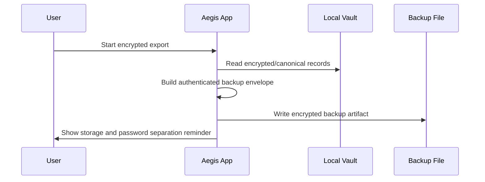
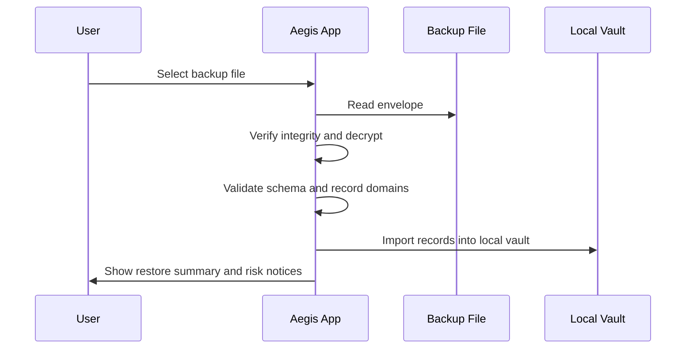

# Aegis Vault Backup And Recovery Model

Last updated: 2026-05-07

Aegis backup and recovery is designed for local-first users who need encrypted, portable, testable recovery without turning the product into a cloud custody service.

## Backup Principles

- Prefer encrypted backups over plaintext exports.
- Keep backup passwords/recovery material separate from the backup file.
- Test restore before relying on a backup for production use.
- Treat plaintext JSON/CSV exports as temporary migration artifacts.
- Preserve all current record domains, including passkeys and Crypto Vault records.

## Backup Types

| Type                   | Purpose                                | Security posture                           |
| ---------------------- | -------------------------------------- | ------------------------------------------ |
| Encrypted vault backup | Normal recovery and device migration   | Recommended                                |
| QR sync/export         | Air-gapped device transfer and pairing | Recommended for controlled transfer        |
| JSON export            | Structured migration                   | High risk unless encrypted externally      |
| CSV export             | Compatibility/migration                | Highest risk; remove immediately after use |
| Emergency kit          | Break-glass recovery guidance          | Store offline and separately               |

## Current Data Coverage

Backups and canonical export/import flows should preserve:

- Login records, cards, identities, secure notes, WiFi records
- TOTP metadata and setup details
- Passkey metadata: RP ID, origin, credential ID, transport, verification state
- Alias privacy metadata and provider notes
- Sharing/emergency access metadata where supported
- Crypto Vault records:
  - chain/network
  - public address
  - custody mode
  - xpub/ypub/zpub or watch-only metadata
  - derivation path
  - manual balance and notes
  - encrypted seed/private key material when explicitly stored

## Encrypted Backup Flow



Recommended user practice:

1. Export encrypted backup.
2. Store backup on offline media or a controlled encrypted drive.
3. Store backup password/recovery key separately.
4. Restore into a test vault periodically.
5. Rotate old backups after major security changes.

## Restore Flow



Restore should fail closed when:

- Backup authentication/integrity verification fails.
- Required schema version fields are missing.
- Crypto secret material is malformed.
- Passkey metadata cannot be parsed safely.
- A destructive import would overwrite data without explicit user confirmation.

## Crypto Vault Backup Rules

Crypto Vault is intentionally sensitive:

- Watch-only records are backup-safe but still require address verification after restore.
- Encrypted seed/private key records must display explicit recovery risk warnings.
- Plaintext exports containing crypto secret material should be treated as critical exposure.
- Aegis does not sign or broadcast transactions after restore.

## Passkey Backup Rules

Passkey records may contain useful metadata, but WebAuthn private keys remain bound to authenticators and platforms.

Backups should preserve:

- RP ID
- origin
- credential ID
- display name
- transport
- authenticator attachment
- verification status

Backups cannot guarantee that an external authenticator credential remains valid after device loss. Users should keep passkey recovery methods for important services.

## Operational Checklist

Before production use:

- Create the first encrypted backup.
- Store recovery material offline.
- Add at least one second-factor recovery route for critical accounts.
- Test restore with a small sample vault.
- Confirm Crypto Vault records restore with correct chain/address metadata.
- Confirm passkey records show RP ID/origin after restore.

Before release:

```bash
npm run test -- src/lib/__tests__/BackupService.test.ts
npm run test:security-regression
npm run build
```

## Known Limits

- Aegis cannot recover a lost master password without valid recovery material.
- A corrupted backup without a valid integrity envelope should not be imported.
- CSV/JSON plaintext exports are not safe long-term storage.
- Device-bound WebAuthn credentials may require re-enrollment on the service side.
