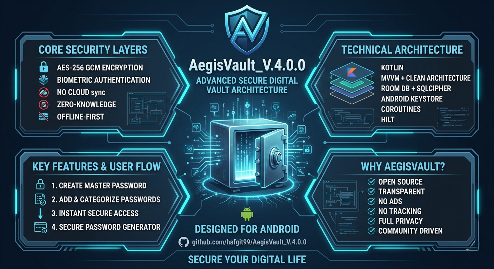

# 🛡️ Aegis Vault V.4.0.0 (Fort Knox Update)


> **The Ultimate Secure Vault for Your Digital Life.**
> Experience professional-grade security with a premium aesthetic and a hardened cross-platform bridge.

[](LICENSE)
[](https://github.com/hafgit99/AegisVault_V.4.0.0)
[](RELEASE_CHECKLIST.md)
[](https://react.dev/)
[](https://www.typescriptlang.org/)
[](https://vitejs.dev/)
[](https://www.electronjs.org/)

---

<p align="center">
  
</p>

---

## 🌟 Overview

**Aegis Vault** is a high-security, multi-platform vault application designed to protect your sensitive information—from passwords to private documents. Built with a focus on **Visual Excellence** and **Unbreakable Security**, Aegis Vault offers a seamless experience across Web, Desktop (Windows), and Browser Extensions (Chrome/Edge/Firefox).

## ✨ Key Features

-   **🔒 Military-Grade Encryption**: Powered by AES-256 via `crypto-js` and `hash-wasm`.
-   **🛡️ JIT Scripting Injection**: Uses high-performance `browser.scripting` for injection, eliminating persistent content script overhead and increasing privacy.
-   **🔄 Nonce & Replay Protection**: Secure `postMessage` protocol with single-use cryptographic nonces for sync actions.
-   **🌉 Loopback-Extension Bridge**: A dedicated `X-Aegis-Client` header-based authentication for reliable communication between the extension and desktop client.
-   **🏗️ Hardened KDF**: Implements Argon2id (64MB / 3 iterations) for master password hashing and encrypted backups.
-   **📊 QR Data Sync**: Synchronize your vault across devices securely using local QR-based data sync (No cloud needed).
-   **🎨 Premium UI/UX**: Stunning interface with glassmorphism, Framer Motion, and a curated color palette.
-   **🔑 Password Generator**: Built-in secure password generator with real-time strength analysis.

---

## 🛠️ Technology Stack

| Layer | Technologies |
| :--- | :--- |
| **Frontend** | React 19, TypeScript, Vite, Framer Motion |
| **Styling** | Tailwind CSS 4, Lucide Icons, Custom UI System |
| **Desktop** | Electron 40, Electron Builder (Hardened IPC) |
| **Extension** | WXT Framework (Manifest V3, JIT Content Script) |
| **Storage** | IndexedDB (idb), WA-SQLite (OPFS Persistence) |
| **Security** | Argon2id, AES-GCM, Hash-WASM, DOMPurify |

---

## 🚀 Getting Started

### Prerequisites

-   **Node.js** (Latest LTS recommended)
-   **npm** or **yarn**

### Installation

1.  **Clone the Repository**
    ```bash
    git clone https://github.com/hafgit99/AegisVault_V.4.0.0.git
    cd AegisVault_V.4.0.0
    ```

2.  **Install Dependencies**
    ```bash
    npm install
    ```

3.  **Run Development Server**
    ```bash
    npm run dev
    ```

### Building for Production

-   **Web App**: `npm run build`
-   **Browser Extension**: `npm run build:extension`
-   **Desktop App (Windows)**: `npm run build:electron`

---

## 🛡️ Security Protocols

Aegis Vault implements a multi-layered security architecture to ensure your data remains private even in compromised environments.

- **Zero-Knowledge Architecture**: Encryption and decryption happen strictly on the client-side. Your Master Password never leaves your device.
- **Argon2id KDF**: We utilize the Argon2id algorithm for key derivation, protecting against brute-force attacks with memory-hard parameters.
- **AES-GCM Authenticated Encryption**: All vault data and backups are encrypted using AES-256-GCM, providing both confidentiality and integrity.
- **JIT Content Script**: The Aegis extension uses Just-In-Time injection. It only activates when you specifically request actions (Fill/Analyze).
- **IPC Nonce Validation**: All communication between components is protected by single-use cryptographic nonces to prevent replay attacks.

---

## 🤝 Support & Donation

If you find Aegis Vault useful, consider supporting the project. **Donations are accepted exclusively within the application** via the secure Donation Modal, supporting various cryptocurrencies.

- **Crypto Donations**: Open the app and click on the "Donate" button in the menu or footer.
- **GitHub**: Star the project on [GitHub](https://github.com/hafgit99/AegisVault_V.4.0.0)

---

## ⚖️ License

Distributed under the MIT License. See `LICENSE` for more information.

Copyright © 2026 Aegis Vault.

---

<p align="center">
  MADE BY <a href="https://github.com/hafgit99"><b>HAFGIT99</b></a> WITH ❤️
</p>
