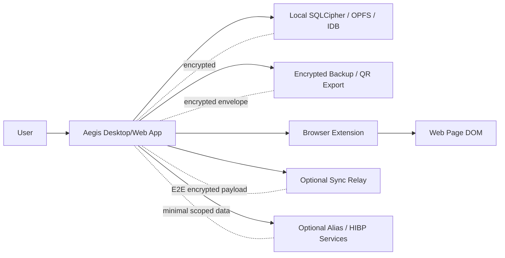

# Aegis Vault Threat Model

Last updated: 2026-05-07

This document describes the security assumptions, protected assets, trust boundaries, attacker capabilities, and mitigations for Aegis Vault 5.x.

## Security Goals

Aegis is designed to:

- Keep decrypted vault data local to the user's device.
- Prevent relay, extension, backup, and sharing flows from receiving plaintext secrets by default.
- Make high-risk flows explicit, reviewable, and testable.
- Preserve recoverability through encrypted backups and documented emergency workflows.
- Reduce privacy exposure through alias support, optional HIBP k-anonymity checks, and cautious autofill policy controls.

## Protected Assets

| Asset                  | Examples                                                            | Required protection                                      |
| ---------------------- | ------------------------------------------------------------------- | -------------------------------------------------------- |
| Master secret          | Master password, setup secret, unlock key material                  | Never stored or transmitted as plaintext                 |
| Vault entries          | Passwords, cards, identities, notes, passkeys, TOTP, crypto records | Encrypted at rest and in backup/sync envelopes           |
| Crypto custody data    | Seed phrases, private keys, derivation notes                        | Encrypted secret mode only; no signing/broadcast runtime |
| Watch-only crypto data | Public addresses, xpub/ypub/zpub, chain metadata                    | Integrity and phishing-resistant UX                      |
| Passkey metadata       | RP ID, origin, credential ID, server verification state             | Integrity, origin visibility, risk triage                |
| Backup material        | Encrypted backup files, recovery notes, QR sync packets             | Authenticated encryption and user warning boundaries     |
| Extension bridge state | Native messaging, autofill records, site policy                     | Origin/domain checks and user-controlled policy          |
| Sync payloads          | Relay envelopes, device sessions, conflict metadata                 | E2E encryption, replay resistance, sequence tracking     |

## Trust Boundaries

Key boundaries:

- The web page DOM is not trusted.
- The sync relay is not trusted with plaintext.
- Browser extension content scripts run near hostile pages and must minimize exposed data.
- Alias/HIBP integrations are optional and should receive only scoped data.
- Local device compromise is outside the primary protection boundary.

## Attacker Model

Aegis aims to resist:

- Network observers between client and optional sync relay.
- Malicious or compromised sync relay operators.
- Tampered backup files.
- Replay of QR sync or sharing messages.
- Phishing-prone copy/autofill workflows where the user can be warned.
- Origin/RP mismatch in passkey records.
- Accidental plaintext export or unsafe crypto custody handling.

Aegis does not fully protect against:

- Malware with local process memory access.
- Keyloggers, screen capture tools, or malicious clipboard managers.
- A malicious browser with full extension compromise.
- A user intentionally exporting plaintext and storing it unsafely.
- Loss of both master credentials and recovery material.

## Major Threats And Mitigations

| Threat                      | Risk                                             | Mitigations                                                                   |
| --------------------------- | ------------------------------------------------ | ----------------------------------------------------------------------------- |
| Offline vault theft         | Encrypted database file is copied                | Argon2id key derivation, AES-256-GCM, SQLCipher/WASM storage                  |
| Backup tampering            | Restore imports modified data                    | HMAC/integrity envelope, restore validation, format checks                    |
| Plaintext export misuse     | User stores CSV/JSON insecurely                  | Explicit warnings, encrypted export preferred, crypto record warning copy     |
| Relay compromise            | Relay reads or modifies sync data                | Client-side encryption, HMAC/authentication, sequence/replay controls         |
| Extension autofill phishing | Credential filled into wrong page                | Site policy, insecure-page review, domain matching, user approval flows       |
| Passkey RP mismatch         | Credential metadata used for wrong relying party | RP ID/origin visibility, origin mismatch risk flag, server verification state |
| Crypto private key misuse   | App becomes a hot wallet unintentionally         | Watch-only default, no signing/broadcast code path, secret mode warnings      |
| HIBP privacy leakage        | Password or full hash leaves device              | k-anonymity range model where enabled, optional privacy-mode toggle           |
| Alias provider exposure     | Provider API data leaks identity                 | Scoped provider config, alias risk panel, rotation and exposure tracking      |
| Emergency access abuse      | Contact receives access too early                | Wait windows, manual approval, granted access audit trail                     |

## Security Invariants

The following invariants should be preserved by future changes:

- The sync relay never receives decrypted vault entries.
- The browser extension never receives more data than needed for the current site/action.
- Crypto Vault must not sign or broadcast transactions.
- Watch-only crypto records must remain separate from encrypted secret custody records.
- Import/export must preserve crypto wallet fields, passkey metadata, and backup integrity metadata.
- Passkey records must expose RP ID and origin for review.
- Plaintext exports must remain visibly high-risk.

## Review Requirements For High-Risk Changes

Changes in these areas should include tests and documentation updates:

- Key derivation, encryption, storage, backup, restore
- Sync relay protocol, QR pairing, device trust
- Extension bridge, autofill, native messaging
- Passkey/WebAuthn handling
- Crypto Vault custody fields
- HIBP, alias provider, and privacy integrations
- Release signing, SBOM, and provenance scripts

## Residual Risks

- Browser and OS compromise can bypass application-level protections.
- Clipboard warnings reduce but cannot eliminate address-substitution malware.
- Watch-only balances are not live-chain authoritative unless integrated with a trusted indexer in the future.
- External provider privacy depends partly on the provider's own controls.
- A lost master password plus missing recovery material remains unrecoverable by design.
